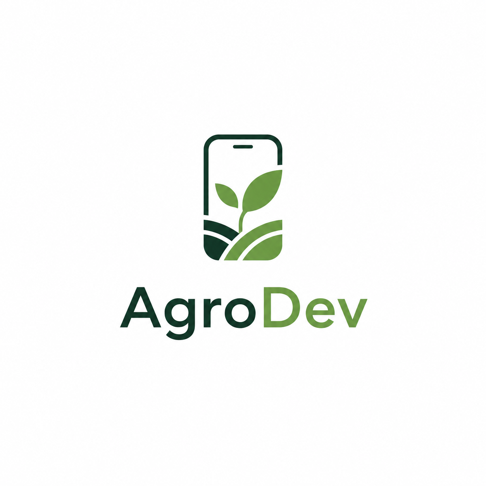

# AgroDev

<p align="center">
  
</p>

<p align="center">
  <strong>Data and trust for a climate-resilient food system.</strong><br />
  A student project from Moldova for the Oxford Saïd Global Climate Tech Challenge 2026.
</p>

<p align="center">
  <a href="https://agrodev.lovable.app">Explore the prototype</a>
  &nbsp;·&nbsp;
  <a href="https://www.youtube.com/watch?v=maDrQPge89g">Watch the project video</a>
</p>

---

## The challenge

Climate pressure exposes weak links throughout the food system. Farmers often have to make costly irrigation and technology decisions with incomplete, hard-to-interpret information. Consumers, meanwhile, have limited visibility into where food came from and how it was produced.

AgroDev responds to this gap with a practical, connected approach: turn field and weather data into understandable decisions, help farmers use technology well, and make food journeys more transparent.

## Our focus: climate-smart irrigation

The contest prototype focuses on a measurable intervention in food security: **reducing avoidable water use without compromising plant growth**.

Instead of irrigating on a fixed timer, the approach combines soil conditions and weather information to recommend only the water a crop needs. The intended pilot compares a standard fixed-schedule irrigation setup with a sensor-informed setup under the same growing conditions.

### How the prototype works

1. **Measure** - collect soil moisture and local environmental conditions.
2. **Interpret** - combine readings with weather data and crop needs.
3. **Recommend** - provide a clear next action for irrigation rather than raw data alone.
4. **Verify** - compare water use and plant-growth indicators against a control setup.

This evidence-first design keeps the project honest: the prototype is designed to test a concrete hypothesis before claims of scale are made.

## The wider AgroDev platform

The website presents the long-term product vision in three connected layers:

| Layer | Purpose |
| --- | --- |
| **Farm intelligence** | Transform field and weather data into practical guidance for irrigation, crop care, fertiliser and equipment use. |
| **Practical learning** | Offer short, field-ready guides and evidence from pilot farms so farmers can understand and evaluate new technologies. |
| **Food traceability** | Use QR-linked product information to make origin, producer, date and available inspection details easier to follow. |

These layers are a roadmap. The competition prototype is the irrigation-focused foundation of that roadmap.

## Project website

This repository contains the public AgroDev project website. It includes:

- an explanation of the challenge and the proposed solution;
- an embedded project video;
- a link to the interactive AgroDev prototype;
- introductions to the four-person team;
- a dedicated team-interviews page;
- responsive navigation and layout for phones, tablets and desktops.

## Team

AgroDev is a four-student team from Moldova combining science, sustainability, design and technology.

| Member | Contribution |
| --- | --- |
| **Valeria** | Biology and sustainability |
| **Anna** | Research, communication and project development |
| **Masha** | Biology, medicine and chemistry |
| **Boris** | Robotics, IT and technical direction |

## Technology

- React 19 + TypeScript
- TanStack Start and TanStack Router
- Vite
- Tailwind CSS 4
- Radix UI components
- Vercel-ready Nitro server output

## Run locally

### Prerequisites

- Node.js 20 or newer
- npm 10 or newer

### Installation

```bash
git clone https://github.com/xondell/agrodev-climate-champion.git
cd agrodev-climate-champion
npm install
npm run dev
```

Open the local address printed by Vite, normally `http://localhost:3000`.

### Production checks

```bash
npm run lint
npm run build
npm run preview
```

## Project structure

```text
src/
├── components/
│   └── SiteLayout.tsx       # Shared header, mobile menu, footer and external links
├── routes/
│   ├── index.tsx            # Main project story
│   └── interview.tsx        # Team interviews
├── styles.css               # Global visual system and responsive styles
└── server.ts                # Server entry point

public/
├── agrodev-logo.png         # AgroDev visual identity
└── team/                    # Local team photography
```

## Content updates

The two external links used across the website are deliberately centralised in [`src/components/SiteLayout.tsx`](src/components/SiteLayout.tsx):

- `APP_URL` - the interactive AgroDev prototype;
- `YOUTUBE_VIDEO_ID` - the public project video.

Update those values if the app or video moves. Team descriptions and project copy are located in [`src/routes/index.tsx`](src/routes/index.tsx); interview content is in [`src/routes/interview.tsx`](src/routes/interview.tsx).

## Deploy to Vercel

1. Push this repository to GitHub.
2. In [Vercel](https://vercel.com/new), choose **Add New → Project** and import `xondell/agrodev-climate-champion`.
3. Keep Vercel's detected build settings. The repository already configures Nitro for the `vercel` preset.
4. Select **Deploy**.

Every subsequent push to `main` will create a new production deployment when the GitHub integration is enabled.

## Project video

[Watch AgroDev's project video on YouTube](https://www.youtube.com/watch?v=maDrQPge89g)

---

Built by **AgroDev, Moldova** for the **Oxford Saïd Global Climate Tech Challenge 2026**.
